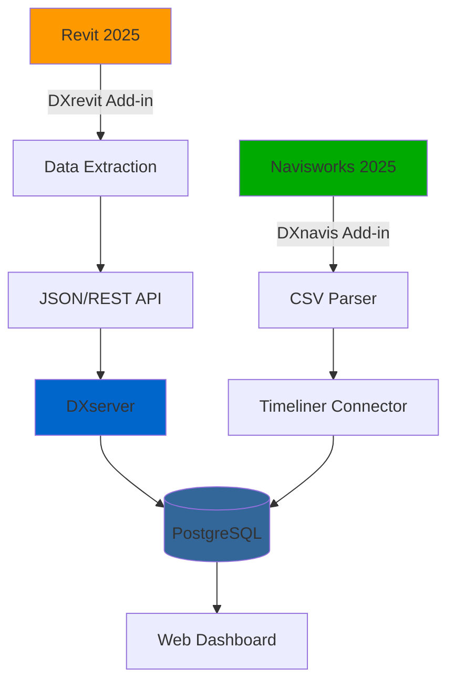

<div align="center">

# 🏗️ BIM-DXPlatform

**Digital Transformation Platform for BIM Data Integration**

[](LICENSE)
[](https://dotnet.microsoft.com/)
[](https://www.autodesk.com/products/revit/)
[]()

*Seamlessly connect Revit and Navisworks with centralized data management for design change tracking and 4D simulation automation.*

[Features](#-features) • [Quick Start](#-quick-start) • [Documentation](#-documentation) • [Roadmap](#-roadmap)

</div>

---

## 🎯 What is BIM-DXPlatform?

BIM-DXPlatform is an integrated solution that bridges the gap between **Autodesk Revit** and **Navisworks**, enabling:

- 📊 **Automated Data Extraction**: Extract BIM data from Revit models with one click
- 🔄 **Real-time Synchronization**: Keep design changes tracked across multiple platforms
- 📈 **4D Simulation**: Automatically connect CSV schedules to Navisworks Timeliner
- 🗄️ **Centralized Management**: Store and manage all BIM data in a single database

### Why BIM-DXPlatform?

| Problem | Our Solution |
|---------|--------------|
| ❌ Manual data entry is time-consuming | ✅ Automated extraction and synchronization |
| ❌ Design changes get lost in communication | ✅ Automatic change tracking and history |
| ❌ Disconnected tools and workflows | ✅ Unified platform for Revit & Navisworks |
| ❌ Complex 4D setup process | ✅ One-click Timeliner connection |

---

## ✨ Features

### 🔌 DXrevit (Revit Add-in)


- **Snapshot Capture**: Extract entire model data including geometry, parameters, and relationships
- **Shared Parameters**: Automatically add custom parameters (DX_ActivityId, DX_SyncId, etc.)
- **Settings Management**: Configure API server, timeout, and logging preferences
- **Progress Tracking**: Real-time progress bar for large models

### 🔗 DXnavis (Navisworks Add-in)

*Coming in Phase 4*

- **CSV Parser**: Read schedule data from CSV files
- **Timeliner Auto-Connection**: Automatically map tasks to model elements
- **Object Set Management**: Create and manage selection sets based on activity IDs

### 🌐 DXserver (API Backend)

*Coming in Phase 3*

- **RESTful API**: Receive and store BIM data from add-ins
- **Change Detection**: Compare snapshots and identify modifications
- **PostgreSQL Database**: Robust storage for large-scale projects
- **Authentication**: Secure access with OAuth 2.0

---

## 🚀 Quick Start

### Prerequisites

- **Autodesk Revit 2025**
- **Windows 10/11** (x64)
- **.NET 8.0 Runtime** (included with Revit 2025)

### Installation

#### Option 1: Download Release (Recommended)

1. Download the latest release from [Releases](https://github.com/tygwan/BIM-DXPlatform/releases)
2. Extract the ZIP file
3. Run `install.bat` as Administrator
4. Restart Revit

#### Option 2: Build from Source

```bash
# Clone the repository
git clone https://github.com/tygwan/BIM-DXPlatform.git
cd BIM-DXPlatform

# Build the solution
dotnet build -c Release

# Install to Revit
.\scripts\deploy.ps1 -Target Revit -Configuration Release
```

### First Use

1. **Open Revit 2025**
2. Look for the **"DX Platform"** tab in the ribbon
3. Click **"Settings"** to configure your API server (optional)
4. Open a Revit model and click **"Snapshot Capture"**
5. View progress and check logs in `%AppData%\Roaming\DX_Platform\Logs`

<details>
<summary>📸 Click to see screenshots</summary>

*Screenshots will be added here*

</details>

---

## 📚 Documentation

### For Users
- [Installation Guide](docs/user/installation.md)
- [User Manual](docs/user/user-guide.md)
- [Tutorials](docs/user/tutorials.md)
- [FAQ](docs/user/faq.md)

### For Developers
- [Development Setup](docs/dev/setup-guide.md)
- [Architecture Overview](docs/dev/architecture.md)
- [Contributing Guide](CONTRIBUTING.md)
- [API Reference](docs/dev/api-reference.md)

---

## 🏗️ System Architecture



### Component Overview

| Component | Technology | Status | Description |
|-----------|-----------|---------|-------------|
| **DXBase** | .NET Standard 2.0 / .NET 8.0 | ✅ Released | Shared library for common services and models |
| **DXrevit** | .NET 8.0 (WPF) | ✅ Released | Revit add-in for data extraction |
| **DXnavis** | .NET Framework 4.8 | 🚧 Phase 4 | Navisworks add-in for 4D integration |
| **DXserver** | ASP.NET Core 8.0 | 🚧 Phase 3 | REST API server and database |

---

## 🗺️ Roadmap

### ✅ Phase 1: Foundation (Completed)
- [x] DXBase shared library
- [x] Configuration and logging services
- [x] Data transfer objects (DTOs)

### ✅ Phase 2: Revit Integration (Completed)
- [x] DXrevit add-in with ribbon UI
- [x] Snapshot capture functionality
- [x] Shared parameter management
- [x] Auto-deployment system

### 🚧 Phase 3: Backend Development (Q1 2026)
- [ ] DXserver REST API
- [ ] PostgreSQL database schema
- [ ] Authentication and authorization
- [ ] Change detection algorithm

### 🚧 Phase 4: Navisworks Integration (Q2 2026)
- [ ] DXnavis add-in framework
- [ ] CSV schedule parser
- [ ] Timeliner auto-connection
- [ ] 4D simulation support

### 🔮 Phase 5: Advanced Features (Q3 2026)
- [ ] Real-time sync (SignalR)
- [ ] Web dashboard (Blazor)
- [ ] Mobile app (Xamarin/MAUI)
- [ ] AI-powered change prediction

---

## 🤝 Contributing

We welcome contributions! Please see our [Contributing Guide](CONTRIBUTING.md) for details.

### How to Contribute

1. **Fork** the repository
2. **Create** a feature branch (`git checkout -b feature/AmazingFeature`)
3. **Commit** your changes (`git commit -m 'Add some AmazingFeature'`)
4. **Push** to the branch (`git push origin feature/AmazingFeature`)
5. **Open** a Pull Request

### Development Setup

See [Development Setup Guide](docs/dev/setup-guide.md) for detailed instructions.

---

## 📄 License

This project is licensed under the **MIT License** - see the [LICENSE](LICENSE) file for details.

---

## 🙏 Acknowledgments

- **Autodesk** for Revit and Navisworks APIs
- **The Building Coder** for invaluable Revit API resources
- **Community Contributors** who help improve this project

---

## 📞 Support

- 🐛 [Report a Bug](https://github.com/tygwan/BIM-DXPlatform/issues/new?labels=bug)
- 💡 [Request a Feature](https://github.com/tygwan/BIM-DXPlatform/issues/new?labels=enhancement)
- 💬 [Discussions](https://github.com/tygwan/BIM-DXPlatform/discussions)
- 📧 Email: tygwan@users.noreply.github.com

---

<div align="center">

**⭐ Star this project if you find it useful!**

Made with ❤️ by the BIM-DXPlatform Team

</div>

## 🏗️ 프로젝트 구조

### DXBase (공용 라이브러리)
- **타겟**: .NET Standard 2.0 / .NET 8.0
- **역할**: 데이터 모델, 서비스 공유
- **주요 기능**:
  - ConfigurationService: 설정 관리
  - LoggingService: 통합 로깅
  - DataTransferObjects: 공통 DTO

### DXrevit (Revit 애드인)
- **타겟**: .NET 8.0-windows (Revit 2025)
- **역할**: BIM 데이터 추출 및 전송
- **주요 기능**:
  - 스냅샷 저장: 모델 전체 데이터 추출
  - 공유 매개변수 설정: DX_ 접두사 매개변수 추가
  - 실시간 동기화: 변경 사항 자동 전송

### DXnavis (Navisworks 애드인)
- **타겟**: .NET Framework 4.8 (Navisworks 2025)
- **역할**: CSV 스케줄 → Timeliner 자동 연결
- **상태**: Phase 3 개발 예정

### DXserver (API 서버)
- **타겟**: .NET 8.0 (ASP.NET Core)
- **역할**: 데이터 수신/저장 및 동기화
- **상태**: Phase 3 개발 예정

## 🚀 시작하기

### 필수 요구사항
- Visual Studio 2022 (17.8+)
- .NET 8.0 SDK
- .NET Framework 4.8 Developer Pack
- Autodesk Revit 2025
- Autodesk Navisworks 2025 (선택)

### 빌드 방법

#### 전체 솔루션 빌드
```bash
cd "개발폴더"
dotnet build DXPlatform.sln
```

#### 개별 프로젝트 빌드
```bash
# DXBase
dotnet build DXBase/DXBase.csproj

# DXrevit (자동 배포 포함)
dotnet build DXrevit/DXrevit.csproj
```

### 배포

#### DXrevit 자동 배포
빌드 시 자동으로 다음 경로에 배포됩니다:
```
C:\ProgramData\Autodesk\Revit\Addins\2025\
├── DXrevit.addin
└── DXrevit\
    ├── DXrevit.dll
    ├── DXBase.dll
    └── System.Text.Json.dll
```

#### 수동 배포
```powershell
.\scripts\deploy.ps1 -Target Revit
```

## 📖 문서

- [아키텍처 개요](docs/architecture/Phase0_Architecture_Overview.md)
- [DXBase 상세 설계](docs/architecture/Phase1_DXBase.md)
- [DXrevit 개발 가이드](docs/architecture/Phase2_DXrevit.md)
- [배포 가이드](docs/deployment/)
- [문제 해결](docs/troubleshooting/)

## 🔧 개발 환경 설정

### 1. 저장소 클론
```bash
git clone https://github.com/your-org/dx-platform.git
cd dx-platform
```

### 2. 개발 환경 스크립트 실행
```powershell
.\scripts\setup-dev-env.ps1
```

### 3. Revit API 참조 설정
Revit 2025 설치 경로 확인:
```
C:\Program Files\Autodesk\Revit 2025\RevitAPI.dll
C:\Program Files\Autodesk\Revit 2025\RevitAPIUI.dll
```

## 🧪 테스트

```bash
# 단위 테스트 실행
dotnet test tests/DXBase.Tests/

# 통합 테스트
dotnet test tests/DXrevit.Tests/
```

## 📊 프로젝트 상태

### Phase 1: DXBase ✅ 완료
- [x] 공용 서비스 라이브러리
- [x] 설정 및 로깅 시스템
- [x] 데이터 모델 정의

### Phase 2: DXrevit ✅ 완료
- [x] Revit 애드인 기본 구조
- [x] 리본 UI 생성
- [x] 스냅샷 기능
- [x] 공유 매개변수 설정
- [x] 자동 배포 시스템

### Phase 3: DXserver 🚧 진행 예정
- [ ] ASP.NET Core API 서버
- [ ] PostgreSQL 데이터베이스
- [ ] RESTful API 엔드포인트
- [ ] 인증/권한 관리

### Phase 4: DXnavis 🚧 진행 예정
- [ ] Navisworks 애드인 기본 구조
- [ ] CSV 파서
- [ ] Timeliner 자동 연결
- [ ] 4D 시뮬레이션 지원

## 🤝 기여 가이드

1. Fork the repository
2. Create your feature branch (`git checkout -b feature/AmazingFeature`)
3. Commit your changes (`git commit -m 'Add some AmazingFeature'`)
4. Push to the branch (`git push origin feature/AmazingFeature`)
5. Open a Pull Request

## 📝 변경 이력

자세한 변경 이력은 [CHANGELOG.md](CHANGELOG.md)를 참조하세요.

## 📄 라이선스

This project is licensed under the MIT License - see the [LICENSE](LICENSE) file for details.

## 👥 개발팀

- **Lead Developer**: [Your Name]
- **Architecture**: [Your Name]

## 🐛 버그 리포트 및 기능 요청

이슈는 [GitHub Issues](https://github.com/your-org/dx-platform/issues)에 등록해주세요.

## 📞 문의

- Email: your-email@example.com
- Project Link: https://github.com/your-org/dx-platform
